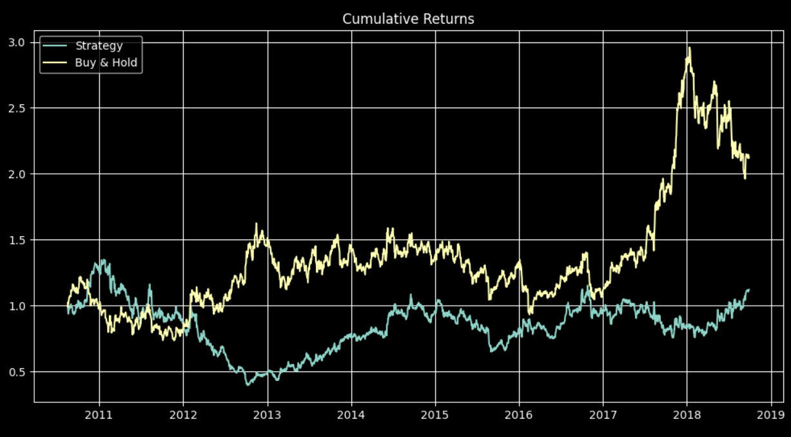
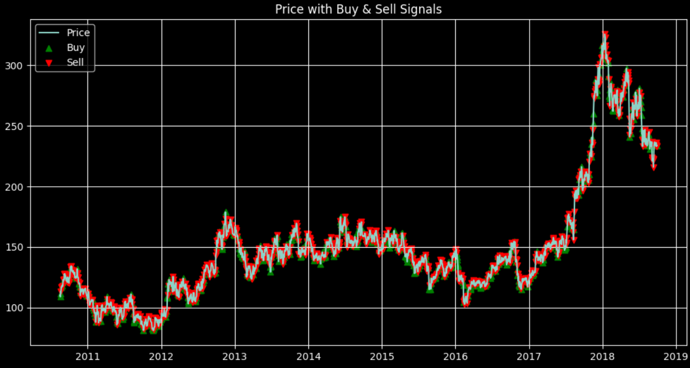
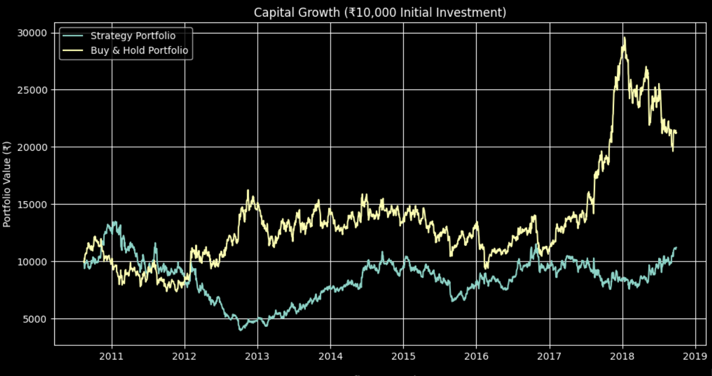

# 📈 Stock Trading Strategy Simulation using Python

🚀 Beginner-friendly Algorithmic Trading & Backtesting Project

## 🔍 Problem Statement
Stock market prediction is challenging due to high volatility. 
This project explores how predicted returns can be converted into trading decisions and evaluates whether such a strategy can outperform a Buy & Hold approach.

## 📌 Overview
💡 This project demonstrates a simplified backtesting approach used in real-world algorithmic trading systems.

## 🧠 Key Features
- Rule-based trading strategy using predicted returns
- Signal generation (Buy/Sell)
- Portfolio simulation with ₹10,000 initial capital
- Performance evaluation using Sharpe Ratio & Drawdown
- Visual analysis using multiple graphs

## 🛠️ Technologies Used
- Python
- NumPy
- Pandas
- Matplotlib

## 🔄 Workflow

1. Load stock price data
2. Calculate daily returns
3. Generate predicted returns
4. Create Buy/Sell signals
5. Avoid look-ahead bias
6. Compute strategy returns
7. Compare with Buy & Hold
8. Evaluate performance

## 📈 Strategy Evaluation

The model evaluates performance using:

- Annual Return
- Volatility
- Sharpe Ratio (Risk-adjusted return)
- Maximum Drawdown

These metrics help in understanding both profitability and risk.

## 📈 Results & Analysis

- Strategy vs Buy & Hold comparison
- Capital growth visualization
- Profit per trade analysis
- Risk evaluation using drawdown

💡 This project demonstrates a simplified backtesting approach used in real-world algorithmic trading systems.

## 📊 Output Visualizations

## ⚠️ Limitations
- Predicted returns are simulated (not from ML model)
- No transaction cost included
- Single stock analysis

## 🚀 Future Improvements
- Integrate LSTM / Deep Learning models
- Add Reinforcement Learning trading agent
- Use real-time stock data APIs
  
## 👨‍💻 Author
Honey Ranjan
